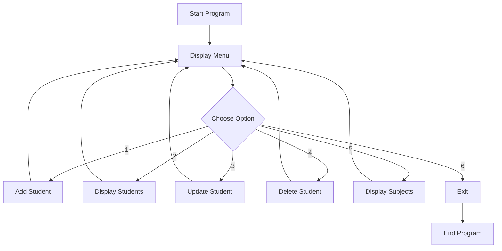

# collection_manipulator

<div align="center">

# 🎓 Student Data Organizer

### Simple Student Record Management System using Python


<br>


</div>

---

# 🌟 About The Project

**Student Data Organizer** is a simple Python-based student record management project.

The project allows the user to manage student information through a menu-driven program.

It provides options to:

- ➕ Add student information
- 📋 Display all student records
- ✏️ Update student information
- 🗑️ Delete student records
- 📚 Display subjects offered
- 🚪 Exit the program

The project uses basic Python concepts such as **lists, dictionaries, sets, loops, conditional statements, input/output, and string operations**.

> **"Organize student information with simple and practical Python programming."**

---

# 🎯 Project Objectives

The main objectives of this project are:

- 🧑‍🎓 Store student information
- 📋 Display student records
- ✏️ Update existing student information
- 🗑️ Remove student records
- 📚 Store and display subjects
- 🔄 Practise menu-driven programming
- 🧠 Improve Python logical thinking
- 💻 Practise working with lists, dictionaries, and sets

---

# ✨ Key Features

<table>
<tr>

<td width="50%">

### ➕ Add Student

Enter student information including:

- Student ID
- Student Name
- Student Age
- Student Grade
- Date of Birth
- Subjects

</td>

<td width="50%">

### 📋 Display Students

Display all available student records with their:

- ID
- Name
- Age
- Grade
- Subjects

</td>

</tr>

<tr>

<td width="50%">

### ✏️ Update Student

Search for a student using their ID and update:

- Age
- Subjects

</td>

<td width="50%">

### 🗑️ Delete Student

Enter a student ID to remove the corresponding student record from the system.

</td>

</tr>

<tr>

<td width="50%">

### 📚 Display Subjects

Display the subjects stored for the students in the records.

</td>

<td width="50%">

### 🚪 Exit

Exit the Student Data Organizer safely using the menu option.

</td>

</tr>

</table>

---

# 🧰 Technology Stack

<div align="center">


</div>

### Core Technology

| Technology | Purpose |
|------------|---------|
| 🐍 Python | Programming Language |
| 💻 VS Code | Code Editor |
| 📦 List | Store multiple student records |
| 📖 Dictionary | Store individual student information |
| 🔹 Set | Store subjects without duplicate values |

---

# 🏗️ Project Structure

```text
pr-3-collection_manipulation/
│
├── student_data_organizer.py
│
└── README.md
```

---

# 🔄 Program Workflow



---

# 📊 Student Record Structure

Each student is stored as a dictionary inside the `student_data` list.

```python
record = {
    "id": (student_id,),
    "name": student_name,
    "age": student_age,
    "grade": student_grade,
    "dob": (student_dob,),
    "subject": subject_list
}
```

The complete student record is then added to the list:

```python
student_data.append(record)
```

---

# 🧠 Python Concepts Used

This project practises several basic Python concepts.

### 📋 List

The list is used to store multiple student records.

```python
student_data = []
```

### 📖 Dictionary

A dictionary stores information about an individual student.

```python
record = {
    "id": (student_id,),
    "name": student_name,
    "age": student_age,
    "grade": student_grade,
    "dob": (student_dob,),
    "subject": subject_list
}
```

### 🔹 Set

A set is used for storing subjects.

```python
subject_list = {item.strip() for item in subjects.split(",") if item.strip()}
```

### 🔄 While Loop

The `while True` loop keeps the menu running until the user chooses the Exit option.

```python
while True:
```

### 🔁 For Loop

The program uses `for` loops to search and display student records.

```python
for record in student_data:
```

### 🔀 Conditional Statements

`if`, `elif`, and `else` are used to handle different menu choices.

```python
if choice == 1:
    ...
elif choice == 2:
    ...
else:
    ...
```

### 📝 User Input

The `input()` function is used to collect student information from the user.

```python
student_name = input("student Name: ")
```

### 🖨️ Output

The `print()` function displays information and messages to the user.

```python
print("Welcome to Student data organizer!")
```

---

# 🔍 Menu Options

When the program starts, the user gets the following menu:

```text
Select an option:
1. Add Student
2. Display all Students
3. Update Student Information
4. Delete Student
5. Display Subjects Offered
6. Exit
```

---

# 🚀 How to Run the Project

## 1. Install Python

Make sure Python is installed on your computer.

You can check the Python version using:

```bash
python --version
```

---

## 2. Open the Project

Open the project folder in **VS Code** or another Python-supported editor.

---

## 3. Run the Program

Run the Python file:

```bash
python student_data.py
```

---

## 4. Select an Option

After running the program, the menu will appear.

Enter a number from **1 to 6** according to the operation you want to perform.

---

# 💻 Example Program Flow

```text
Welcome to Student data organizer!

Select an option:
1. Add Student
2. Display all Students
3. Update Student Information
4. Delete Student
5. Display Subjects Offered
6. Exit

Choose an choice: 1

Enter Student Information

student ID: 101
student Name: Rahul
student Age: 18
student Grade: A
date of Birth: 12-05-2008
enter subjects separated by comma: Python, Maths, English

Record of Rahul added successfully!
```

---

# 🧠 Skills Demonstrated

Through this project, I practised:

- 🐍 Python Programming
- 📋 Lists
- 📖 Dictionaries
- 🔹 Sets
- 🔄 While Loops
- 🔁 For Loops
- 🔀 Conditional Statements
- 📝 User Input
- 🖨️ Output Formatting
- 🔤 String Operations
- 🧠 Logical Thinking
- 📊 Data Organization

---

# 📌 Key Learning Outcomes

### 🐍 Python Programming

Practised creating a menu-driven Python program using basic Python concepts.

### 📋 Data Structures

Learned how to use **lists, dictionaries, and sets** to organize student information.

### 🔄 Program Control

Practised using loops and conditional statements to control the program flow.

### 🧠 Logical Thinking

Improved logical thinking by implementing searching, updating, displaying, and deleting operations.

### 💻 Practical Programming

Built a simple real-world style student record management program.

---

# 🔮 Future Enhancements

The project can be extended in the future with features such as:

- 🔐 Student login system
- 💾 Save student data permanently
- 📂 File-based data storage
- 🔎 Search student by name
- 📊 Student marks management
- 📈 Student performance reports
- 🖥️ Graphical User Interface
- 🗄️ Database integration

---

# 🗺️ Project Roadmap

```text
[████████████████████] 100% Basic Student Records

[████████████████████] 100% Add Student

[████████████████████] 100% Display Students

[████████████████████] 100% Update Student

[████████████████████] 100% Delete Student

[████████████████████] 100% Subject Display

[████████░░░░░░░░░░░░] 40% File Storage

[████░░░░░░░░░░░░░░░░] 20% Database Integration
```

---

# 👨‍💻 About The Project

This project was created as a practical Python programming project to practise basic programming concepts and data structures.

The main focus is on creating a simple and understandable **Student Data Organizer** using Python.

---

# ⭐ Project Highlights

```text
✓ Menu-driven program
✓ Student record management
✓ Add student records
✓ Display student records
✓ Update student information
✓ Delete student records
✓ Subject management
✓ List and Dictionary usage
✓ Set usage
✓ Loops and Conditional Statements
```

---

<div align="center">

## 🚀 Keep Learning. Keep Building. Keep Growing.

### 🐍 Python • 💻 Programming • 🧠 Logic • 📚 Learning

<br>

**Made with ❤️ and Python**

</div>